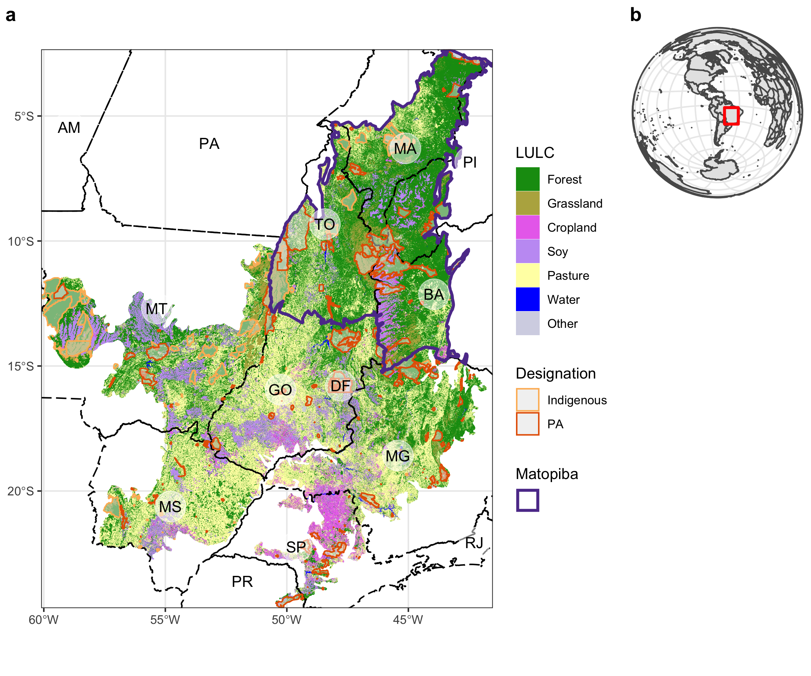
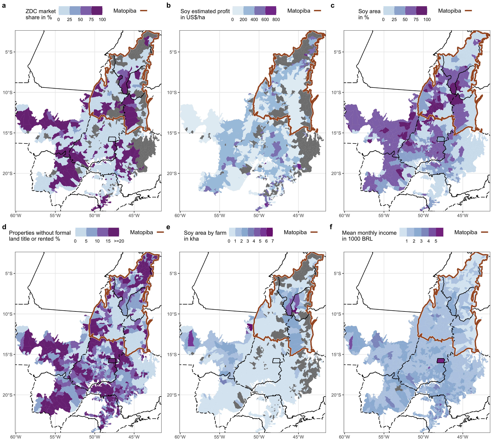

# PES_Cerrado
Quick descriptions: I basically loaded all data from sidra ('Sidra_data.R'), made maps for each indicator (e.g. soy_farms.R), and combined them in 'combine_maps.R'   
data folder: https://www.dropbox.com/sh/2aoimaz15chrc8s/AADlTUyq-UhOwId-w8FnJSBka?dl=0

