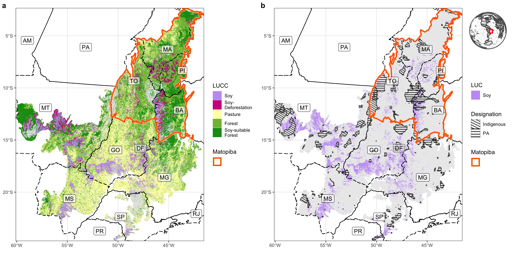

# PES Cerrado
Replication code for maps in: ___R.D. Garrett, J. Grabs, F. Cammelli, F. Gollnow, S.A. Levy. Should payments for environmental services be used to implement zero-deforestation supply chain policies? The case of soy in the Brazilian Cerrado___

## Code author   
Florian Gollnow

## Description   
### Data     
- IBGE data was downloaded from [sidra](https://sidra.ibge.gov.br/home/pms/brasil) ('sidra_data_download.R')   
- Trade data was derived from [trase.earth](https://www.trase.earth/) and prepared in [Gollnow et al. 2022 preprint](https://papers.ssrn.com/sol3/papers.cfm?abstract_id=4006677)  
- Mapbiomas LU-data can be found [here](https://mapbiomas.org/) and was prepared separately in GEE   
- Rent data was prepared by Rodrigo et al. (in prep)   
- Spatial admin data was derived from [IBGE](https://geoftp.ibge.gov.br/) and [MMA](https://www.gov.br/icmbio/pt-br/servicos/geoprocessamento/mapa-tematico-e-dados-geoestatisticos-das-unidades-de-conservacao-federais)   

#### Maps
- maps were made for each indicator (e.g. income.R) and saved as an rds file    
- all maps were combined in 'combine_maps.R'       

